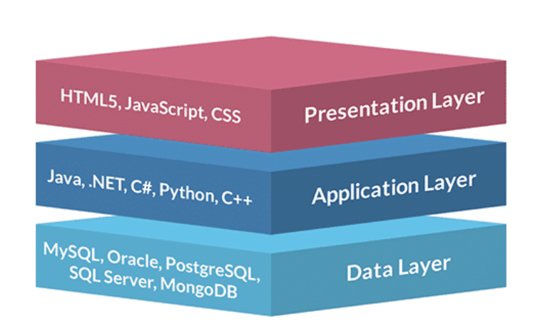
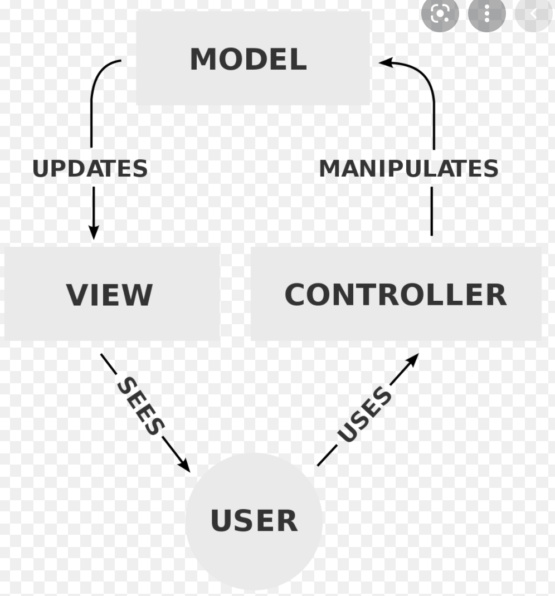
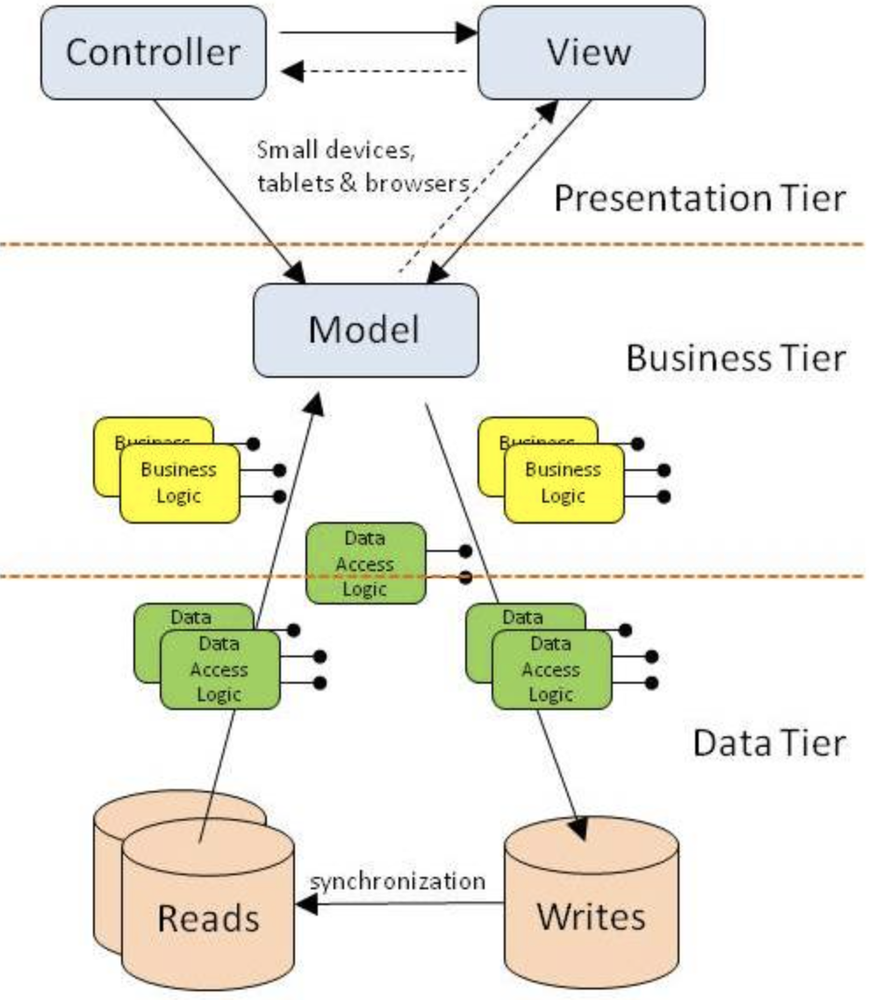
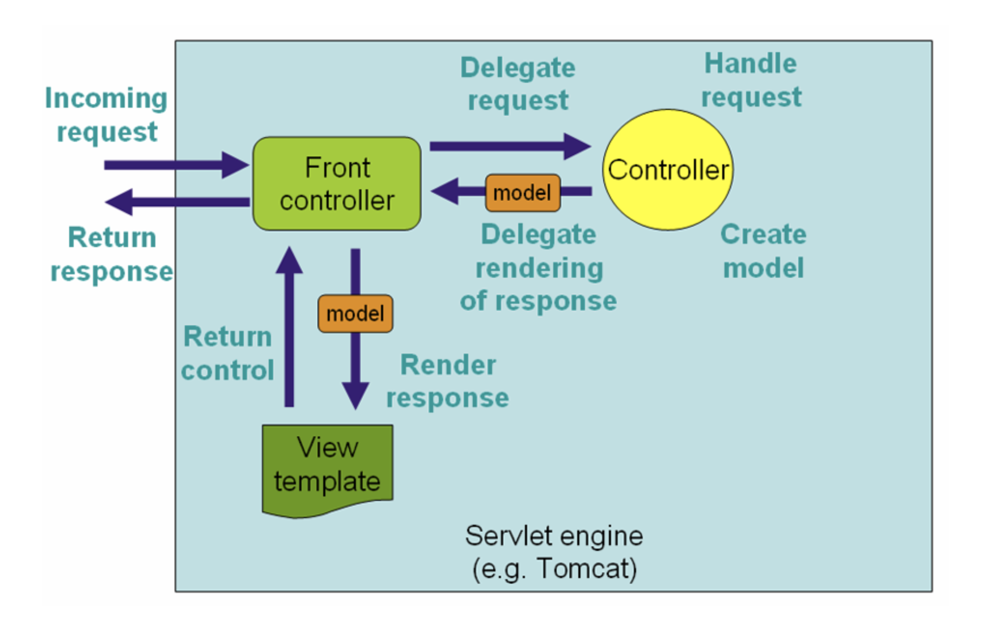

# Wishlist-app

## MVC

MVC is a pattern to create software with graphical user interfaces. In the same sense as a classical n-tier application - it is a abstract simplification and will typically present gray-zones and interpretations when implemtented in real life.

A classic 3 tier application: 

A basic MVC diagram: 



**The 2 architectural are somewhat compatible in such a way as illustrated here:**



## Controllers

A (spring) controller directs incoming requests after being dispatched by the servlet - meaning that the controller can be directly correlated to the "Controller"-pattern from GoF & Larman.

It has been formerly raised that the controller in a spring application should be understood as a "front-controller", but as far as I can tell, this is  a misunderstanding. A front-controller exists in the servlet level abstraction - meaning that the Spring boot servlet already has been acting "front-controller" and delegated the interpreted HTTP request to a "traditional" controller: 



- A spring annotatted controller directs traffic from the application, to the "use case" 

- ```java
  @GetMapping("/all")
  public String wishlistOverview(Model model) {
          model.addAttribute("allWishlists", wishlistService.getAllWishlists());
          return "/wishlist-overview.html";
  }
  ```

  For all requests that adheres to: www.wish-list.com/all

  1. Get all wishlists
  2. Add the attribute to a spring object called "Model"
     1. Model object maps/puts the data on to the view
  3. Return the view with the data from the database to /wishlist-overview.html

  **Controllers are a text-book example of pure fabrication, as it is purely application logic and not really relevant for business**

  **Furthermore, it also shows some relevancy to the indirection pattern** 

## Models

Models are object representations of data. In the application we mainly have 2 models - Wishlists and wishes.

```java
public class Wishlist {
    private int id;
    private String title;
    private ArrayList<Wish> wishes;

    public Wishlist(String title) {
        this.title = title;
    }
//And so on
```

Models can also contain any business logic, specific for a single object - meaning if all wishlists should be able to do a certain action (i.e count the number of wishes and average their price) that logic could be contained in the wishlist model/object

**This adheres to the principles of: Low Coupling/High cohesion & information expert**

## Repositories

Repositories represents the data access layer/data access logic - which is the point of contact to the database. As seen on the third diagram showing the compatibility of MVC / 3 tier - it is located between business logic and persistance.

**This adheres to the principles of: Low Coupling/High cohesion & information expert**

## Services

Services represents business logic as well.

- Services are a layer of abstraction on top of repositories and business logic
- It is widely discussed if they should be used if they only serve to call simple repository calls, but I would argue that they are best-practice as they are an abstraction offering lower coupling such that a data-access layer can change implementation without any controllers are affected.

## Views

Views are HTML files - that are enriched by data 

## Database Manager

The database manager manages a single(ton) connection to the database

## Calling hierachy

HTTP Request from client > Controller > Service > Repository > Model > View

This is an example of a calling hierachy meaning:

- The browser calls www.wishlist-app.com/all
- The server application receives the call
- The controller calls the service
- The service calls the repository
- The repository returns data from the database and maps it to a java object
- The controller receives the model data
  - The controller enriches a HTML page with the data
- The view is returned to the user

